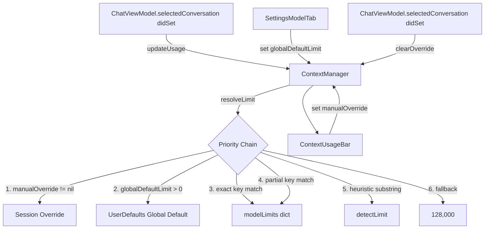

# Design Document: Context Window Override

## Overview

This feature extends `ContextManager` with a two-level override system — a per-session manual override and a persistent global default — so that users can correct the context bar for models not in the lookup table. It also expands the lookup table with modern model entries, improves heuristic detection, and surfaces both controls in the UI: a global default card in Settings → Model tab, and an inline override picker in `ContextUsageBar`.

The priority chain for limit resolution is:
```
session override → global default → exact lookup → partial lookup → heuristic → 128k fallback
```

## Architecture



`ContextManager` remains `@Observable` and is owned by `AppDIContainer`. Views access it exclusively via `@Environment(AppDIContainer.self)`.

## Components and Interfaces

### ContextManager (expanded)

```swift
@Observable
final class ContextManager {
    // Existing observable state
    var currentUsage: Int
    var usagePercentage: Double
    var maxContext: Int

    // New: session override
    var manualOverride: Int?
    var isManualOverride: Bool { manualOverride != nil }

    // New: global default (UserDefaults-backed)
    var globalDefaultLimit: Int  // key: "contextWindowGlobalDefault"; 0 = auto

    // New: public resolution entry point
    func resolveLimit(for model: String) -> Int

    // New: clear session override
    @MainActor func clearOverride()

    // Existing
    @MainActor func updateUsage(messages: [ChatMessage], model: String)

    // New: presets
    struct ContextPreset: Identifiable {
        let id: UUID
        let label: String
        let tokens: Int
    }
    static let presets: [ContextPreset]
}
```

**resolveLimit(for:) priority chain:**
1. `manualOverride` if non-nil and > 0
2. `globalDefaultLimit` if > 0
3. `modelLimits[model]` (exact, case-sensitive)
4. `modelLimits.first { model.lowercased().contains($0.key.lowercased()) }?.value`
5. `detectLimit(for: model)` (substring heuristics)
6. `128_000` fallback

### ContextUsageBar (expanded)

Gains `@Environment(AppDIContainer.self)` and local `@State var showPicker: Bool`. The existing `usage/limit/percentage` parameters are kept for backward compatibility but the view also reads `diContainer.contextManager` directly for override state.

```swift
struct ContextUsageBar: View {
    // Existing params (kept for ChatView compatibility)
    var usage: Int
    var limit: Int
    var percentage: Double

    @Environment(AppDIContainer.self) private var diContainer
    @State private var showPicker = false
}
```

New UI elements:
- Override button (right of percentage label): `chevron.down` when no override, `lock.fill` + "Override" in orange when active
- Inline picker panel (animated with `.spring(response: 0.3, dampingFraction: 0.8)`): horizontal scroll of preset chips (excluding Auto) + "Clear Override" button

### SettingsModelTab (expanded)

Adds a `SettingsCardView` titled "Context Window Default" with icon `text.alignleft` below the existing Top P card. Contains:
- Description label
- Horizontal scroll of preset chips (all presets including Auto)
- "Custom" chip that reveals a `TextField` for arbitrary integer input

Reads/writes `ContextManager.shared.globalDefaultLimit` (Settings views use `.shared` since they are not injected with `AppDIContainer` in the current architecture).

### ChatViewModel (change)

In the `selectedConversation` `didSet`, call `diContainer.contextManager.clearOverride()` before or after `updateUsage`.

```swift
var selectedConversation: Conversation? {
    didSet {
        diContainer.contextManager.clearOverride()
        if let conversation = selectedConversation {
            diContainer.contextManager.updateUsage(
                messages: conversation.sortedMessages,
                model: diContainer.aiManager.settings.modelName
            )
        }
    }
}
```

## Data Models

### ContextPreset

```swift
struct ContextPreset: Identifiable {
    let id: UUID = UUID()
    let label: String   // e.g. "Auto", "128k", "1M"
    let tokens: Int     // 0 for Auto, positive for all others
}
```

Static presets array (ordered):

| Label | Tokens    |
|-------|-----------|
| Auto  | 0         |
| 4k    | 4,096     |
| 8k    | 8,192     |
| 16k   | 16,384    |
| 32k   | 32,768    |
| 64k   | 65,536    |
| 128k  | 131,072   |
| 200k  | 200,000   |
| 1M    | 1,000,000 |
| 2M    | 2,000,000 |

### UserDefaults key

| Key                          | Type  | Default | Meaning                    |
|------------------------------|-------|---------|----------------------------|
| `contextWindowGlobalDefault` | `Int` | `0`     | 0 = auto-detect, >0 = limit |

### Expanded modelLimits dictionary additions

| Key                                | Value     |
|------------------------------------|-----------|
| `moonshotai/kimi-k2-instruct`      | 131,072   |
| `kimi-k2-instruct`                 | 131,072   |
| `gpt-4o-mini`                      | 128,000   |
| `o1`                               | 200,000   |
| `o1-preview`                       | 128,000   |
| `o1-mini`                          | 128,000   |
| `grok-2`                           | 131,072   |
| `grok-2-1212`                      | 131,072   |
| `grok-beta`                        | 131,072   |
| `gemini-2.0-flash`                 | 1,000,000 |
| `gemini-2.0-flash-lite`            | 1,000,000 |
| `gemini-2.5-pro-preview-05-06`     | 2,000,000 |
| `gemma3:latest`                    | 128,000   |
| `codellama`                        | 16,384    |

### Updated heuristic rules (detectLimit)

| Substring (case-insensitive) | Resolved limit |
|------------------------------|----------------|
| `claude`                     | 200,000        |
| `gpt-4`                      | 128,000        |
| `gemini`                     | 1,000,000      |
| `flash`                      | 1,000,000      |
| `128k`                       | 128,000        |
| `32k`                        | 32,000         |
| `16k`                        | 16,000         |
| *(no match)*                 | 128,000        |

Note: the existing `pro` heuristic is removed to avoid false positives (e.g. `o1-preview` contains "pro"). The `flash` heuristic subsumes it for Gemini Flash models.

## Correctness Properties

*A property is a characteristic or behavior that should hold true across all valid executions of a system — essentially, a formal statement about what the system should do. Properties serve as the bridge between human-readable specifications and machine-verifiable correctness guarantees.*

### Property 1: Unknown model fallback is 128k

*For any* model name string that does not match any key in `modelLimits` (exact or partial) and does not contain any heuristic substring (`claude`, `gpt-4`, `gemini`, `flash`, `128k`, `32k`, `16k`), `resolveLimit(for:)` with no session override and no global default SHALL return 128,000.

**Validates: Requirements 1.1, 1.3**

---

### Property 2: Exact lookup match is authoritative

*For any* model name that is a key in `modelLimits`, `resolveLimit(for:)` with no session override and no global default SHALL return exactly the value stored in `modelLimits` for that key.

**Validates: Requirements 2.2, 10.2**

---

### Property 3: Heuristic detection by substring

*For any* model name string that contains a recognized heuristic substring (case-insensitive) and is not an exact or partial key match in `modelLimits`, `resolveLimit(for:)` with no session override and no global default SHALL return the limit associated with that substring. Specifically:
- Contains `claude` → 200,000
- Contains `gpt-4` → 128,000
- Contains `gemini` → 1,000,000
- Contains `flash` → 1,000,000
- Contains `128k` → 128,000
- Contains `32k` → 32,000
- Contains `16k` → 16,000

**Validates: Requirements 3.1, 3.2, 3.3, 3.4, 3.5, 3.6, 3.7**

---

### Property 4: Priority chain ordering

*For any* model name, the following priority invariants hold simultaneously:
- If `manualOverride` is set to a positive integer `n`, then `resolveLimit(for:)` returns `n` regardless of `globalDefaultLimit` or the model name.
- If `manualOverride` is nil and `globalDefaultLimit` is a positive integer `g`, then `resolveLimit(for:)` returns `g` regardless of the model name.
- If both are absent/zero, `resolveLimit(for:)` falls through to lookup/heuristic/fallback.

**Validates: Requirements 4.2, 5.2, 6.3**

---

### Property 5: isManualOverride reflects manualOverride

*For any* value assigned to `manualOverride` (nil or a positive integer), `isManualOverride` SHALL equal `manualOverride != nil`. Setting `manualOverride` to a non-nil value makes `isManualOverride` true; calling `clearOverride()` makes `isManualOverride` false.

**Validates: Requirements 5.3, 5.4**

---

### Property 6: globalDefaultLimit round-trips through UserDefaults

*For any* non-negative integer `n`, setting `globalDefaultLimit = n` and then reading `globalDefaultLimit` SHALL return `n`. This must hold across simulated app restarts (i.e., constructing a new `ContextManager` instance that reads from the same `UserDefaults` suite).

**Validates: Requirements 6.1, 6.4**

---

### Property 7: Context bar color thresholds

*For any* `percentage` value in `[0, 1]`, the fill color of `ContextUsageBar` SHALL be:
- `.green` when `percentage < 0.75`
- `.orange` when `0.75 <= percentage <= 0.90`
- `.red` when `percentage > 0.90`

**Validates: Requirements 9.10, 10.3**

---

## Error Handling

- **Invalid custom token input**: If the user types a non-numeric or zero/negative value in the custom `TextField`, the Settings UI SHALL not update `globalDefaultLimit` and SHALL display an inline validation hint. The field should only commit on valid positive integers.
- **manualOverride set to zero or negative**: `resolveLimit` treats any non-positive `manualOverride` as absent (falls through to next priority level). The UI only exposes positive preset values, so this is a defensive guard.
- **UserDefaults unavailable**: `globalDefaultLimit` getter returns `0` (auto-detect) if `UserDefaults.standard` cannot read the key, ensuring graceful degradation.
- **No provider configured**: `ChatViewModel.sendMessage` continues to guard on `aiManager.activeProvider` before calling `updateUsage`, so `resolveLimit` is never called in that path (Requirement 10.4).

## Testing Strategy

### Unit Tests

Focus on specific examples and edge cases:

- `moonshotai/kimi-k2-instruct` resolves to 131,072 (Req 1.2, 2.1)
- All 14 new lookup table entries return their expected values (Req 2.1)
- `globalDefaultLimit = 0` is treated as auto-detect (Req 6.2 edge case)
- `clearOverride()` sets `manualOverride` to nil (Req 5.4)
- Conversation switch calls `clearOverride()` (Req 5.5)
- Static `presets` array has exactly 10 entries in the specified order (Req 7.2)
- Provider not configured → no `resolveLimit` call (Req 10.4)

### Property-Based Tests

Use [SwiftCheck](https://github.com/typelift/SwiftCheck) for property-based testing. Each test runs a minimum of 100 iterations.

**Property 1 — Unknown model fallback**
```swift
// Feature: context-window-override, Property 1: unknown model fallback is 128k
property("unknown model resolves to 128k") <- forAll { (s: String) in
    guard !isKnownModel(s) && !hasHeuristicSubstring(s) else { return true }
    let cm = ContextManager()
    return cm.resolveLimit(for: s) == 128_000
}
```

**Property 2 — Exact lookup match**
```swift
// Feature: context-window-override, Property 2: exact lookup match is authoritative
property("exact key returns dictionary value") <- forAll(Gen.fromElements(of: knownModelKeys)) { key in
    let cm = ContextManager()
    return cm.resolveLimit(for: key) == expectedLimits[key]!
}
```

**Property 3 — Heuristic detection**
```swift
// Feature: context-window-override, Property 3: heuristic detection by substring
property("claude substring resolves to 200k") <- forAll { (prefix: String, suffix: String) in
    let model = prefix + "claude" + suffix
    guard !isExactOrPartialMatch(model) else { return true }
    let cm = ContextManager()
    return cm.resolveLimit(for: model) == 200_000
}
// (repeat for each heuristic substring)
```

**Property 4 — Priority chain**
```swift
// Feature: context-window-override, Property 4: priority chain ordering
property("manualOverride wins over everything") <- forAll { (override: Int, model: String) in
    guard override > 0 else { return true }
    let cm = ContextManager()
    cm.manualOverride = override
    return cm.resolveLimit(for: model) == override
}

property("globalDefault wins when no session override") <- forAll { (global: Int, model: String) in
    guard global > 0 else { return true }
    let cm = ContextManager()
    cm.globalDefaultLimit = global
    return cm.resolveLimit(for: model) == global
}
```

**Property 5 — isManualOverride**
```swift
// Feature: context-window-override, Property 5: isManualOverride reflects manualOverride
property("isManualOverride == (manualOverride != nil)") <- forAll { (n: Int?) in
    let cm = ContextManager()
    cm.manualOverride = n
    return cm.isManualOverride == (n != nil)
}
```

**Property 6 — globalDefaultLimit persistence**
```swift
// Feature: context-window-override, Property 6: globalDefaultLimit round-trips through UserDefaults
property("globalDefaultLimit round-trips") <- forAll { (n: Int) in
    guard n >= 0 else { return true }
    let cm = ContextManager()
    cm.globalDefaultLimit = n
    let cm2 = ContextManager() // new instance reads same UserDefaults
    return cm2.globalDefaultLimit == n
}
```

**Property 7 — Color thresholds**
```swift
// Feature: context-window-override, Property 7: context bar color thresholds
property("fill color matches percentage thresholds") <- forAll { (pct: Double) in
    guard pct >= 0 && pct <= 1 else { return true }
    let color = ContextUsageBar.fillColor(for: pct)
    if pct > 0.9 { return color == .red }
    if pct > 0.75 { return color == .orange }
    return color == .green
}
```

Both unit and property tests should be placed in a `ContextWindowOverrideTests` test target. Property tests require SwiftCheck added as a package dependency.
