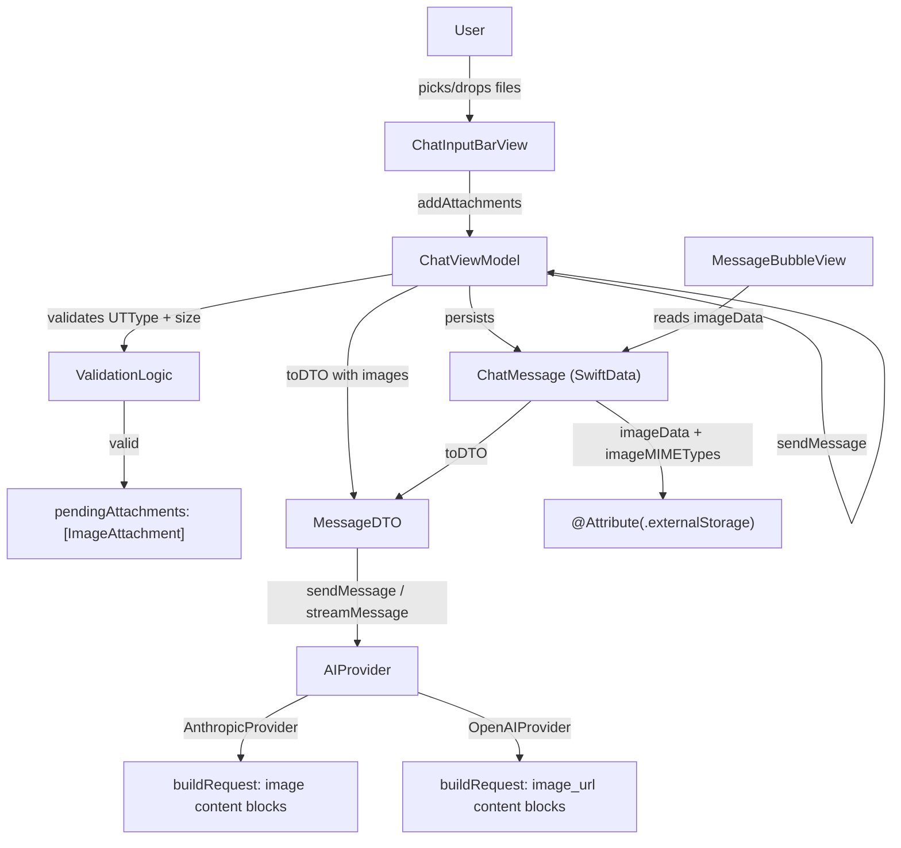

# Design Document: Vision Image Input

## Overview

This feature adds image attachment support to Jiano's chat interface. Users can attach up to 5 images per message via a file picker or drag-and-drop. Images are previewed as thumbnails in the input bar, persisted with the `ChatMessage` SwiftData model using external storage, rendered inline in message bubbles, and transmitted as base64-encoded content blocks to vision-capable providers (Anthropic and OpenAI).

The design extends existing types minimally: `MessageDTO` gains an optional image payload array, `ChatMessage` gains two parallel arrays for image data and MIME types, and both providers gain image-aware `buildRequest` paths. Non-vision providers silently drop images with a UI warning shown before send.

## Architecture

The feature follows the existing MVVM + DI container pattern. No new architectural layers are introduced.



### Key Design Decisions

- Image data is held in memory as `[ImageAttachment]` on `ChatViewModel` only until the message is sent, then persisted to `ChatMessage` and released from the pending list.
- `MessageDTO` carries `[ImagePayload]` (a `Sendable` struct) so providers never touch SwiftData objects across actor boundaries.
- Base64 encoding happens inside each provider's `buildRequest`, not in the ViewModel, keeping encoding concerns at the API boundary.
- The 5-image cap and size limits are enforced in `ChatViewModel.addAttachments`, not in the view, so both picker and drag-drop paths share the same validation.

## Components and Interfaces

### ImageAttachment (new value type)

```swift
struct ImageAttachment: Identifiable, Sendable {
    let id: UUID
    let data: Data
    let mimeType: String   // e.g. "image/jpeg"
    let filename: String
}
```

Held in `ChatViewModel.pendingAttachments: [ImageAttachment]`. Cleared after send.

### ImagePayload (new value type, in AIProvider.swift)

```swift
struct ImagePayload: Sendable {
    let data: Data
    let mimeType: String
}
```

Carried by `MessageDTO` across concurrency boundaries.

### MessageDTO (extended)

```swift
struct MessageDTO: Sendable {
    let role: String
    let content: String
    let images: [ImagePayload]   // empty for text-only messages
}
```

### ChatMessage (extended SwiftData model)

Two new parallel arrays added with `@Attribute(.externalStorage)` on the data array:

```swift
@Attribute(.externalStorage) var imageData: [Data]
var imageMIMETypes: [String]
```

`toDTO` is updated to populate `images` from these arrays.

### ChatViewModel (extended)

New state and methods:

```swift
var pendingAttachments: [ImageAttachment] = []
var attachmentError: String? = nil

func addAttachments(_ urls: [URL])   // shared validation path
func removeAttachment(id: UUID)
func openFilePicker()                // presents NSOpenPanel
```

`sendMessage` is updated to:
1. Check `provider.supportsVision`; if false and attachments are pending, send text only.
2. Validate each attachment's base64 size against provider-specific limits (5 MB Anthropic, 20 MB OpenAI).
3. Populate `userMessage.imageData` and `userMessage.imageMIMETypes` before inserting into SwiftData.
4. Clear `pendingAttachments` after the message is saved.

### ChatInputBarView (extended)

New UI elements:
- Attachment button (paperclip icon) to the left of the text field.
- Thumbnail strip (`ScrollView(.horizontal)`) above the text field, shown only when `pendingAttachments` is non-empty.
- Drop target overlay on the text input area.
- Vision warning banner below the thumbnail strip when `!provider.supportsVision && !pendingAttachments.isEmpty`.
- Inline error label driven by `chatVM.attachmentError`.

### MessageBubbleView (extended)

Inside `userBubble`, images are rendered above the text content:

```swift
if !message.imageData.isEmpty {
    imageGrid(message.imageData, mimeTypes: message.imageMIMETypes)
}
```

A `@State var fullScreenImage: NSImage?` drives a full-screen overlay sheet.

### AnthropicProvider (extended)

`buildRequest` checks `dto.images`. If non-empty, the user message `content` field becomes an array:

```json
[
  {"type": "image", "source": {"type": "base64", "media_type": "image/jpeg", "data": "..."}},
  {"type": "text", "text": "user text here"}
]
```

If empty, content remains a plain string (existing behavior).

### OpenAIProvider (extended)

`buildRequest` checks `dto.images`. If non-empty, the user message `content` field becomes an array:

```json
[
  {"type": "image_url", "image_url": {"url": "data:image/jpeg;base64,..."}},
  {"type": "text", "text": "user text here"}
]
```

If empty, content remains a plain string (existing behavior).

## Data Models

### ChatMessage SwiftData additions

```swift
@Model
final class ChatMessage {
    // ... existing fields ...

    /// Raw image bytes, stored outside the SQLite store to avoid bloat.
    @Attribute(.externalStorage)
    var imageData: [Data]

    /// Parallel array of MIME type strings ("image/jpeg", "image/png", etc.)
    /// Index i corresponds to imageData[i].
    var imageMIMETypes: [String]
}
```

`imageData` and `imageMIMETypes` are initialized to `[]` in the existing `init`. The `Codable` conformance is extended to encode/decode both arrays.

### MessageDTO additions

```swift
struct ImagePayload: Sendable {
    let data: Data
    let mimeType: String
}

struct MessageDTO: Sendable {
    let role: String
    let content: String
    let images: [ImagePayload]
}
```

`ChatMessage.toDTO` updated:

```swift
var toDTO: MessageDTO {
    MessageDTO(
        role: role,
        content: content,
        images: zip(imageData, imageMIMETypes).map { ImagePayload(data: $0, mimeType: $1) }
    )
}
```

### Attachment state in ChatViewModel

```swift
struct ImageAttachment: Identifiable, Sendable {
    let id = UUID()
    let data: Data
    let mimeType: String
    let filename: String
}

// In ChatViewModel:
var pendingAttachments: [ImageAttachment] = []
var attachmentError: String?
```

## Correctness Properties

*A property is a characteristic or behavior that should hold true across all valid executions of a system — essentially, a formal statement about what the system should do. Properties serve as the bridge between human-readable specifications and machine-verifiable correctness guarantees.*

### Property 1: Valid file attachment adds to list

*For any* set of valid image files (JPEG, PNG, GIF, WebP, HEIC) added via picker or drag-drop, each file should appear exactly once in the pending attachment list, and the list length should increase by the number of files added (up to the 5-image cap).

**Validates: Requirements 1.3, 2.3**

### Property 2: Attachment count never exceeds 5

*For any* sequence of add-attachment operations, the pending attachment list count should never exceed 5.

**Validates: Requirements 1.5, 2.5**

### Property 3: Invalid UTType files are rejected

*For any* file whose UTType does not conform to `jpeg`, `png`, `gif`, `webP`, or `heic`, calling `addAttachments` should leave the pending attachment list unchanged.

**Validates: Requirements 2.4, 10.1, 10.2**

### Property 4: Oversized files are rejected

*For any* image file whose raw byte size exceeds 20 MB, calling `addAttachments` should leave the pending attachment list unchanged.

**Validates: Requirements 10.4**

### Property 5: Remove attachment is a clean deletion

*For any* pending attachment list and any attachment ID in that list, calling `removeAttachment(id:)` should result in a list that no longer contains that ID and whose count is exactly one less than before.

**Validates: Requirements 3.4**

### Property 6: Non-vision provider strips images from request

*For any* provider with `supportsVision == false` and any non-empty pending attachment list, the API request body constructed by `sendMessage` should contain no image data.

**Validates: Requirements 4.4**

### Property 7: Image persistence round-trip

*For any* `ChatMessage` saved with N image attachments (data + MIME type pairs), loading that message from SwiftData should yield the same N data values in the same order with the same MIME types.

**Validates: Requirements 5.2, 5.3, 5.5**

### Property 8: toDTO image count invariant

*For any* `ChatMessage`, the count of `ImagePayload` values in the resulting `MessageDTO` should equal the count of `imageData` entries on the `ChatMessage`.

**Validates: Requirements 9.3, 9.5**

### Property 9: Anthropic content block structure

*For any* `MessageDTO` with N image payloads, `AnthropicProvider.buildRequest` should produce a user message whose `content` is an array of exactly N+1 elements: N image blocks (type "image") followed by one text block (type "text").

**Validates: Requirements 7.1, 7.2**

### Property 10: OpenAI content block structure

*For any* `MessageDTO` with N image payloads, `OpenAIProvider.buildRequest` should produce a user message whose `content` is an array of exactly N+1 elements: N image_url blocks (type "image_url") followed by one text block (type "text").

**Validates: Requirements 8.1, 8.2**

### Property 11: Text-only backward compatibility

*For any* `MessageDTO` with an empty `images` array, both `AnthropicProvider.buildRequest` and `OpenAIProvider.buildRequest` should produce a user message whose `content` field is a plain string, not an array.

**Validates: Requirements 7.4, 8.4**

### Property 12: Base64 encoding round-trip

*For any* `Data` value, base64-encoding it and then base64-decoding the result should produce the original `Data`, and the encoded string should contain no newline characters.

**Validates: Requirements 7.3, 8.3**

### Property 13: Image rendering order matches attachment order

*For any* `ChatMessage` with an ordered list of image data values, the images rendered in `MessageBubbleView` should appear in the same order as `message.imageData`.

**Validates: Requirements 6.3**

### Property 14: Invalid image data shows placeholder

*For any* `Data` value that cannot be decoded into an `NSImage`, the image slot in `MessageBubbleView` should render the placeholder view rather than crashing or showing nothing.

**Validates: Requirements 6.5**

## Error Handling

| Scenario | Handler | User-visible outcome |
|---|---|---|
| UTType validation failure | `ChatViewModel.addAttachments` | `attachmentError` set; file not added |
| File > 20 MB | `ChatViewModel.addAttachments` | `attachmentError` set; file not added |
| Anthropic per-image > 5 MB base64 | `ChatViewModel.sendMessage` | `errorMessage` set; send aborted |
| OpenAI per-image > 20 MB base64 | `ChatViewModel.sendMessage` | `errorMessage` set; send aborted |
| Non-vision provider with attachments | `ChatViewModel.sendMessage` | Images silently dropped; text sent; warning shown in UI |
| NSOpenPanel cancelled | `ChatInputBarView.openFilePicker` | No-op; attachment list unchanged |
| Image data undecodable at render time | `MessageBubbleView` | Placeholder icon + "Image unavailable" text |
| SwiftData external storage failure | `ChatViewModel.sendMessage` | `errorMessage` set via `try?` save failure path |

Error state is surfaced through two properties on `ChatViewModel`:
- `attachmentError: String?` — shown inline in the input bar, auto-cleared on next successful add or send.
- `errorMessage: String?` — existing property, reused for send-time failures.

## Testing Strategy

### Unit Tests

Focus on specific examples, edge cases, and error conditions:

- `ChatViewModel.addAttachments` with exactly 5 valid files → list count == 5
- `ChatViewModel.addAttachments` with 6 files → list count == 5, `attachmentError` non-nil
- `ChatViewModel.addAttachments` with a `.pdf` file → list unchanged, error set
- `ChatViewModel.addAttachments` with a 21 MB file → list unchanged, error set
- `ChatViewModel.removeAttachment` on a non-existent ID → list unchanged
- `ChatMessage.toDTO` on a message with 0 images → `images` is empty
- `AnthropicProvider.buildRequest` with 0 images → content is a String
- `OpenAIProvider.buildRequest` with 0 images → content is a String
- `MessageBubbleView` with empty `imageData` → no image views rendered

### Property-Based Tests

Use [SwiftCheck](https://github.com/typelift/SwiftCheck) (or swift-testing with custom generators). Each test runs a minimum of 100 iterations.

Each test is tagged with the format: `Feature: vision-image-input, Property N: <property text>`

**Property 1 test** — `Feature: vision-image-input, Property 1: Valid file attachment adds to list`
Generate random counts (1–5) of valid image data values. Call `addAttachments`. Assert list count equals input count.

**Property 2 test** — `Feature: vision-image-input, Property 2: Attachment count never exceeds 5`
Generate random sequences of add operations (total > 5). Assert list count ≤ 5 after each operation.

**Property 3 test** — `Feature: vision-image-input, Property 3: Invalid UTType files are rejected`
Generate random file URLs with non-image extensions. Assert list is unchanged after `addAttachments`.

**Property 4 test** — `Feature: vision-image-input, Property 4: Oversized files are rejected`
Generate `Data` values of size > 20 MB. Assert list is unchanged after `addAttachments`.

**Property 5 test** — `Feature: vision-image-input, Property 5: Remove attachment is a clean deletion`
Generate a random list of 1–5 attachments, pick a random ID. Assert post-remove count == pre-remove count - 1 and ID absent.

**Property 6 test** — `Feature: vision-image-input, Property 6: Non-vision provider strips images from request`
Generate random `MessageDTO` values with 1–5 images. Pass to a mock non-vision provider's request builder. Assert no image keys in the serialized body.

**Property 7 test** — `Feature: vision-image-input, Property 7: Image persistence round-trip`
Generate random arrays of (Data, mimeType) pairs. Save to a `ChatMessage` in an in-memory SwiftData container. Reload and assert data and MIME types match in order.

**Property 8 test** — `Feature: vision-image-input, Property 8: toDTO image count invariant`
Generate random `ChatMessage` instances with 0–5 image data values. Assert `toDTO.images.count == imageData.count`.

**Property 9 test** — `Feature: vision-image-input, Property 9: Anthropic content block structure`
Generate random `MessageDTO` values with 0–5 images. Call `buildRequest`. Parse the body JSON. Assert content array length == images.count + 1, first N elements have type "image", last has type "text".

**Property 10 test** — `Feature: vision-image-input, Property 10: OpenAI content block structure`
Same as Property 9 but for `OpenAIProvider`. Assert type "image_url" for image blocks.

**Property 11 test** — `Feature: vision-image-input, Property 11: Text-only backward compatibility`
Generate random text-only `MessageDTO` values (empty images). Call `buildRequest` on both providers. Assert content value is a JSON string, not an array.

**Property 12 test** — `Feature: vision-image-input, Property 12: Base64 encoding round-trip`
Generate random `Data` values. Encode with `base64EncodedString()`. Assert decode returns original data. Assert encoded string contains no `\n` or `\r`.

**Property 13 test** — `Feature: vision-image-input, Property 13: Image rendering order matches attachment order`
Generate random ordered arrays of valid image data. Construct a `ChatMessage`. Assert the image views in `MessageBubbleView` appear in the same index order as `imageData`.

**Property 14 test** — `Feature: vision-image-input, Property 14: Invalid image data shows placeholder`
Generate random `Data` values that are not valid image formats (e.g., random bytes). Assert `MessageBubbleView` renders the placeholder view for each slot.
